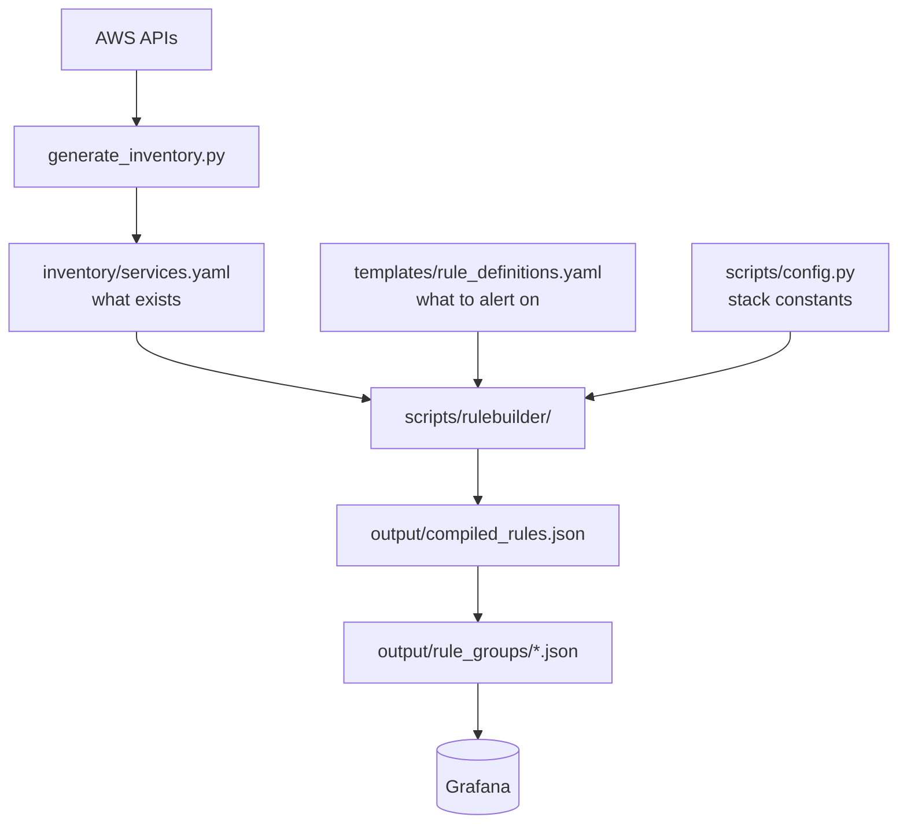

# Grafana Alerts

Provisioning toolkit for a CloudWatch-backed Grafana alert stack.

It reads an AWS resource inventory and a set of rule definitions, compiles them
into Grafana alert rules, and applies them to a Grafana instance as rule groups
routed to a Microsoft Teams contact point.


|                           |                                   |
| ------------------------- | --------------------------------- |
| Grafana                   | `https://grafana.example.com`     |
| AWS region                | `us-west-1`                       |
| Alert folder UID          | `example-folder`                  |
| CloudWatch datasource UID | `example-cloudwatch`              |
| Rule prefix               | `alerts-`                         |
| Contact point             | `engineering-alerts`              |


Every one of these lives in `scripts/config.py`. Change them there, never inline.

---

## How it works



The two YAML files answer different questions. The **inventory** says which ECS
services, load balancers, databases, caches and brokers exist. The **rule
definitions** say which metric thresholds matter. `rulebuilder` takes the cross
product, applying exclusions, and emits one Grafana rule per surviving pair.

Compilation is **completely offline**: no Grafana token, no AWS call, no
network. Only the apply steps talk to Grafana.

This repository ships a small **demo inventory** (`app-alpha`, `app-beta`,
`infra`, etc.) so the toolkit can be compiled and tested without real
infrastructure. Replace it by regenerating from your own AWS account.

### Layout

```
config/                     teams_webhook.yaml - webhook source configuration
inventory/                  services.yaml - AWS resource inventory (demo)
templates/                  rule_definitions.yaml - alert thresholds
scripts/                    all supported tooling (see below)
scripts/rulebuilder/        rule compilation package
output/                     compiled_rules.json, rule_groups/, excluded_resources.json
reports/                    human-readable CSV/Markdown plans
baseline/                   frozen snapshot used to prove zero drift
tests/                      pytest suite (offline)
legacy/                     retired scripts, kept for reference only - do not run
```

### `scripts/rulebuilder/`


| Module           | Responsibility                                                                                                      |
| ---------------- | ------------------------------------------------------------------------------------------------------------------- |
| `resources.py`   | Map a resource type to its inventory list; build CloudWatch dimensions and ECS labels                               |
| `exclusions.py`  | Decide which resources get no rule (missing baseline, Aurora auto-scaling storage, apply-batch/canary partitioning) |
| `queries.py`     | Build the Grafana query model: CloudWatch node, math, reduce and threshold conditions                               |
| `annotations.py` | Summary, runbook, and the unit-aware threshold text the Teams card renders                                          |
| `dashboards.py`  | Build deep links into the right dashboard with the right template variables                                         |
| `compiler.py`    | `build_rule` and `expand_rules`; assigns the stable UID                                                             |


---

## Rule UIDs are load-bearing

A rule's UID is derived from a seed string:

```
alerts-{rule_id}:{cluster}:{resource_name}:{metric}    # ECS services
alerts-{rule_id}:{resource_name}:{metric}              # everything else
```

Grafana uses the UID to decide whether an apply **updates** an existing rule or
**creates a new one**. Changing the seed format, the rule prefix, or a resource
name reassigns UIDs, and applying that would replace existing alerts, losing
alert state and silences.

`tests/test_uid_stability.py` and `scripts/compare_baseline.py` both guard this.

---

## Making a change

### Adjusting a threshold or adding an alert

Edit `templates/rule_definitions.yaml`, then:

```powershell
.\run.ps1 apply_rules.py --dry-run --output output/compiled_rules.json
py -3.13 scripts/compare_baseline.py       # review exactly what moved
py -3.13 -m pytest
py -3.13 scripts/build_rule_groups.py
py -3.13 scripts/validate_compiled_rules.py --compiled output/compiled_rules.json --limitation-fix
```

`compare_baseline.py` prints every added, removed and changed rule with the
before/after value. Read it before applying. Expect it to be non-empty here -
that is the point. Confirm the changes are only the ones you intended, then:

```powershell
py -3.13 scripts/apply_rule_groups.py --dry-run
py -3.13 scripts/apply_rule_groups.py
py -3.13 scripts/verify_applied.py
```

Once a change is deliberately applied, refresh the baseline so it represents the
new intended state:

```powershell
Copy-Item output/compiled_rules.json baseline/compiled_rules.baseline.json
```

### Changing which resources are monitored

Resource lists are generated, not hand-edited. Re-run the generator (this is the
only step that needs AWS credentials, read-only):

```powershell
py -3.13 scripts/generate_inventory.py
```

---

## Commands

### Read-only (safe to run anytime)


| Command                                                                             | Purpose                                                                                    |
| ----------------------------------------------------------------------------------- | ------------------------------------------------------------------------------------------ |
| `generate_inventory.py`                                                        | Rebuild `inventory/services.yaml` from AWS. **Needs AWS credentials** (read-only). |
| `apply_rules.py --dry-run --output output/compiled_rules.json`           | Compile rules. Fully offline.                                                              |
| `compare_baseline.py`                                                               | Diff compiled rules against `baseline/`. Exit 0 only if identical.                         |
| `build_rule_groups.py`                                                              | Turn compiled rules into rule-group payloads.                                              |
| `validate_compiled_rules.py --compiled output/compiled_rules.json --limitation-fix` | Check labels, annotations, URLs and UIDs.                                                  |
| `build_reports.py`                                                             | Write the CSV/Markdown plans under `reports/`.                                             |
| `validate_urls.py`                                                                  | HTTP-check every dashboard link. Needs a Grafana read token.                               |
| `backup.py`                                                                         | Export live Grafana rules, contact points and templates.                                   |
| `verify_applied.py`                                                                 | Compare live Grafana against compiled rules; writes post-deploy reports.                   |


### Writes to Grafana


| Command                           | Purpose                                                                                                       |
| --------------------------------- | ------------------------------------------------------------------------------------------------------------- |
| `provision_notification_stack.py` | Create the notification template, `engineering-alerts` contact point and notification policy. Run this **first**. |
| `canary_test.py`                  | Create one temporary alert, confirm it reaches Teams, then delete it.                                         |
| `apply_rule_groups.py`            | Apply all rule groups. Supports `--dry-run`, `--only`, `--start-from`.                                        |
| `rollback.py --dry-run`           | Preview deletion of every `alerts-` entity. Drop `--dry-run` to delete.                                       |
| `create_contact_point.py`         | Contact point only; a subset of `provision_notification_stack.py`.                                            |


### Full first-time deployment

```powershell
py -3.13 scripts/generate_inventory.py
py -3.13 scripts/apply_rules.py --dry-run --output output/compiled_rules.json
py -3.13 -m pytest
py -3.13 scripts/build_rule_groups.py
py -3.13 scripts/validate_compiled_rules.py --compiled output/compiled_rules.json --limitation-fix
py -3.13 scripts/build_reports.py
# ---- everything below writes to Grafana ----
py -3.13 scripts/backup.py
py -3.13 scripts/provision_notification_stack.py
py -3.13 scripts/canary_test.py
py -3.13 scripts/apply_rule_groups.py --dry-run
py -3.13 scripts/apply_rule_groups.py
py -3.13 scripts/verify_applied.py
```

`run.ps1` wraps any of these, installing `requirements.txt` first:

```powershell
.\run.ps1 apply_rules.py --dry-run --output output/compiled_rules.json
```

---

## Credentials

Three secrets are needed, and **only by the commands that talk to Grafana or
Teams**. Compilation, tests and validation need none of them.


| Credential          | Environment variable                            | Secret key    |
| ------------------- | ----------------------------------------------- | ------------- |
| Grafana read token  | `GRAFANA_READ_TOKEN`                       | `read_token`  |
| Grafana write token | `GRAFANA_WRITE_TOKEN` or `GRAFANA_API_KEY` | `write_token` |
| Teams webhook URL   | `GRAFANA_TEAMS_WEBHOOK_URL`                     | `webhook_url` |


Resolution order is **environment variable first, AWS Secrets Manager second**,
so a local `.env` always wins and remains a working fallback.

Verify with a read-only call that authenticates but writes nothing:

```powershell
py -3.13 scripts/apply_rule_groups.py --dry-run
```

Secret values are never logged. `secrets_store.py` errors name the env var and
the secret key, never the value.

### Local development

Copy `.env.example` to `.env` and fill it in. `.env` is gitignored.

---

## Tests

```powershell
py -3.13 -m pytest
```

Offline tests, no network and no credentials. The most important is
`test_compiled_output.py`, a golden-master check that recompiles from YAML and
asserts the result is byte-identical to `baseline/compiled_rules.baseline.json`.
If a refactor breaks it, alert behaviour changed.

---

## Known limitations

- `resource_type: ecs` **specs compile to zero rules.** The inventory has no
`ecs_clusters` key, only `ecs_services`, so cluster-level ECS rules never
expand. This is long-standing and preserved deliberately - "fixing" it would
create new alerts. `tests/test_exclusions.py` pins the behaviour.

---

## Security

Do not open a public issue for a security problem. See [SECURITY.md](SECURITY.md)
for how to report one privately, what is in scope, and the credential-handling
assumptions this toolkit relies on.

## License

MIT - see [LICENSE](LICENSE).
